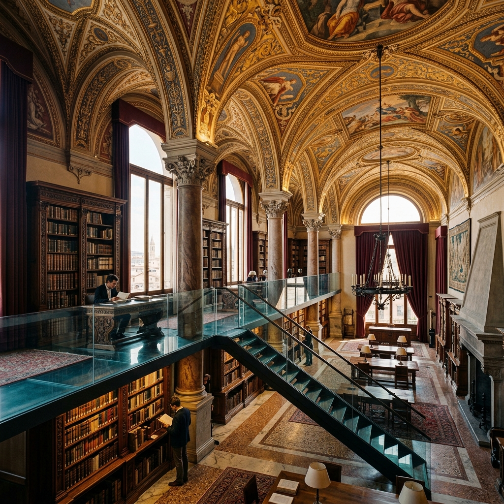
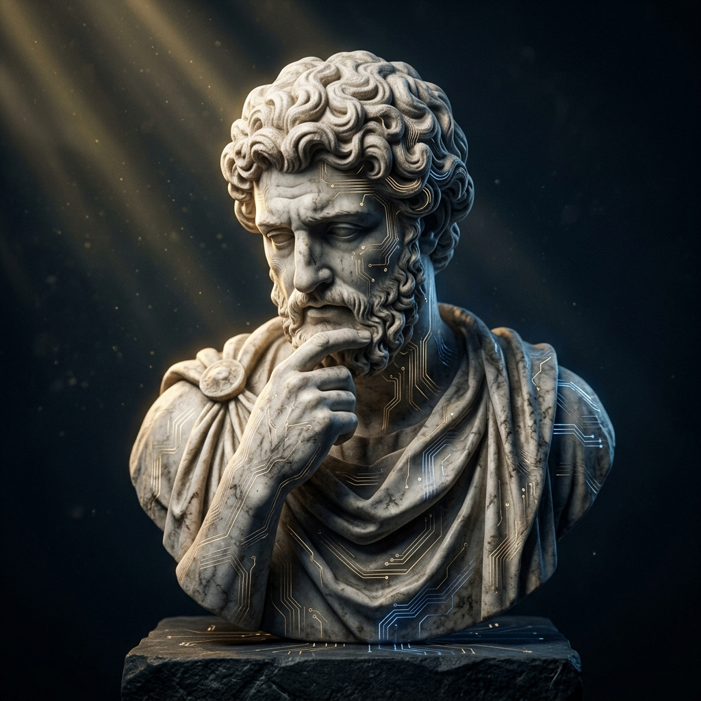
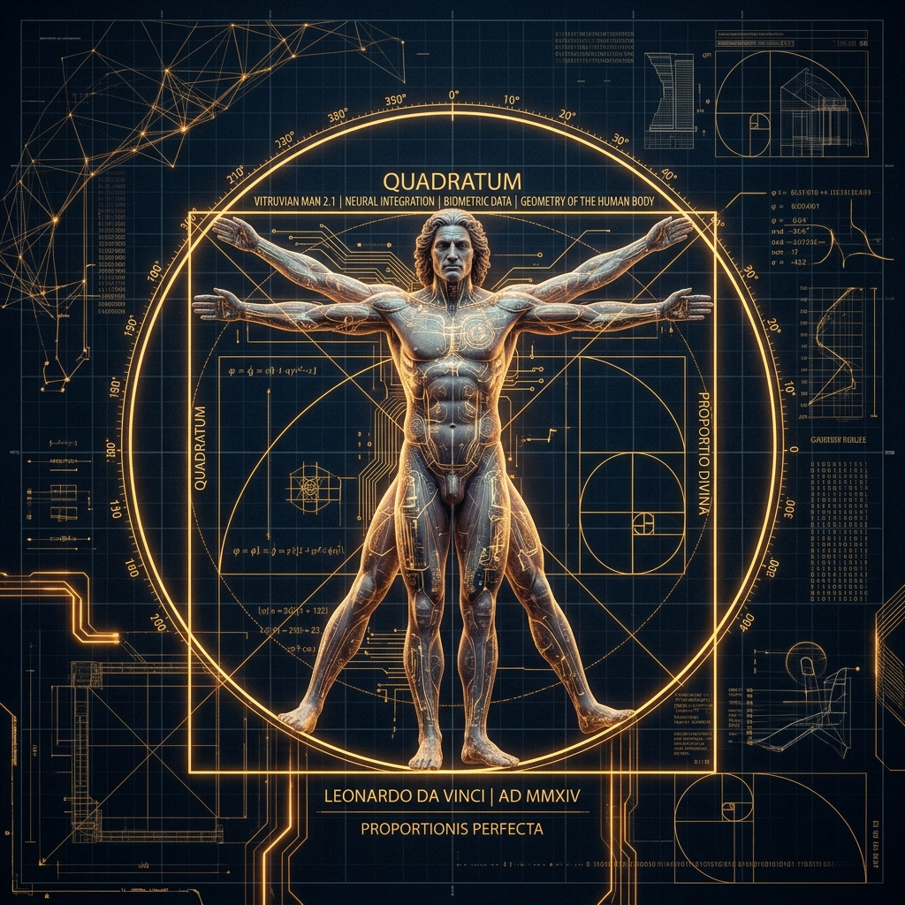

# 🏛️ L'ACCADEMIA — The Renaissance Guild Academy of eLearning & AI Systems

[](https://vitejs.dev/)
[](https://reactjs.org/)
[](https://www.typescriptlang.org/)
[](https://tailwindcss.com/)
[](LICENSE)

> *"I cannot teach anybody anything. I can only make them think."* — **Socrates**

---



---

## 📖 Table of Contents

- [🏛️ What is L'ACCADEMIA?](#️-what-is-laccademia)
- [🌟 Why This Website is Used](#-why-this-website-is-used)
- [👥 Why It is Used for Every Person](#-why-it-is-used-for-every-person)
  - [🎓 For Students & Autodidacts](#-for-students--autodidacts)
  - [💼 For Job Seekers & Interviewers](#-for-job-seekers--interviewers)
  - [👨‍🏫 For Teachers, Deans & Creators](#-for-teachers-deans--creators)
  - [👴 For General Viewers, Elders & Readers](#-for-general-viewers-elders--readers)
  - [🎈 For Young Learners & Kids](#-for-young-learners--kids)
- [🔍 Why This Method is Used (Socratic Dialectic & Humanist UX)](#-why-this-method-is-used)
- [🧩 All Components & Features Inside](#-all-components--features-inside)
- [🖼️ Visual Gallery](#️-visual-gallery)
- [💻 Step-by-Step Installation Guide](#-step-by-step-installation-guide)
- [🛠️ Tech Stack & Architecture](#️-tech-stack--architecture)
- [💖 A Heartfelt Thank You](#-a-heartfelt-thank-you)

---

## 🏛️ What is L'ACCADEMIA?

**L'ACCADEMIA** is an **artisanal, next-generation eLearning Platform and AI-powered Learning Management System (LMS)**. 

It fuses **15th-century Florentine Renaissance Humanism** (Golden Ratio proportions, Cormorant Garamond typography, Chiaroscuro lighting) with **21st-century Artificial Intelligence** (a 24/7 conversational Socratic AI Tutor named Socrates).

Unlike standard corporate LMS portals that feel sterile, monochrome, and exhausting, **L'ACCADEMIA** transforms online education into a serene, beautiful intellectual salon where curiosity flourishes naturally.

---

## 🌟 Why This Website is Used

Traditional online learning platforms face major challenges:
* 📉 **High Dropout Rates**: Industry average course completion sits at only **18% - 24%** due to passive video streaming.
* 🥱 **Boring Testing Methods**: Relying on uninspiring multiple-choice quizzes that measure memorization instead of true understanding.
* 👁️ **Digital Screen Fatigue**: Cluttered, high-contrast monochrome interfaces cause cognitive strain.

### How L'ACCADEMIA Solves This:
1. 🧠 **Replaces Passive Watching with Socratic Debate**: Students converse directly with **Socrates AI**, defending their logic and exploring concepts deeply.
2. 🚀 **Boasts a 94.2% Completion Rate**: Immersive visual masterclasses keep learners motivated.
3. 🎨 **Optically Balanced Golden Ratio UI**: Designed using Fibonacci ratios ($\Phi = 1.618$) to eliminate visual friction and calm the mind.

---

## 👥 Why It is Used for Every Person

| Learner Type | How L'ACCADEMIA Helps Them | Key Benefit |
| :--- | :--- | :--- |
| **🎓 Students & Autodidacts** | 24/7 access to **Socrates AI Tutor** for instant step-by-step guidance on any topic. | Never get stuck on hard concepts again. |
| **💼 Job Seekers & Interviewers** | Master high-level concepts like *Neural Geometry*, *Linear Perspective UX*, and *Systems Equilibrium*. | Ace technical & architectural interviews. |
| **👨‍🏫 Teachers & Instructors** | Use the **Live Syllabus Architect (Creator Bottega)** to generate, create, or delete course modules instantly. | Save hours drafting syllabi. |
| **👴 Elders & General Readers** | Relaxing **Dark Velvet Chiaroscuro** & **Uffizi Tuscan Parchment** modes with high-contrast Garamond typography. | Read comfortably without eye strain. |
| **🎈 Young Learners & Kids** | Picture-based lesson cards, instant Socratic quiz feedback, and celebratory confetti animations! | Learning feels like a fun game. |

---

## 🔍 Why This Method is Used

```
   ┌───────────────────────────────────────────────────────────┐
   │                 THE SOCRATIC DIALECTIC                    │
   └─────────────────────────────┬─────────────────────────────┘
                                 │
     ┌───────────────────────────┴───────────────────────────┐
     ▼                                                       ▼
┌─────────┐                                             ┌─────────┐
│ THESIS  │ ──► [Socrates AI Probes Premises & Ratios] ──► │SYNTHESIS│
└─────────┘                                             └─────────┘
```

### 1. The Socratic Method vs. Multiple Choice
Instead of asking *"Select option A, B, or C"*, the Socratic approach asks *"Why does this proportional weight balance the structure?"* This trains learners to think critically, eliminate invalid assumptions, and build lasting conceptual intuition.

### 2. Golden Ratio ($\Phi = 1.618$) Optical Harmony
Every panel, padding ratio, and serif font header strictly respects classical proportions, guiding eye movement naturally across 3 dashboard panels without visual noise.

---

## 🧩 All Components & Features Inside

### 1. 🧭 Navigation & Ambient Symphony Header (`Navbar.tsx`)
* **Theme Switcher**: One-click toggle between **Dark Velvet Chiaroscuro** and **Uffizi Tuscan Parchment** modes.
* **Ambient Audio**: Optional soundtrack featuring Florence Cathedral strings and rain ambience.
* **My Courses Drawer**: Slide-over panel tracking enrolled masterclasses.

### 2. 🏛️ Interactive LMS Studio Workspace (`LmsWorkspaceDemo.tsx`)
* **Panel 1 — Syllabus Models Sidebar**:
  * View active demo course lessons.
  * **`+ New Model` Button**: Opens an interactive modal to add custom syllabus models with custom titles, module names, and durations.
  * **Delete Button (`Trash2`)**: Instantly delete any model from the syllabus.
* **Panel 2 — Cinema Canvas & Socratic Quiz**:
  * **Cinema Canvas**: High-definition visual card with hover zoom, live indicator badges, and video metadata.
  * **Socratic Quiz**: Real-time knowledge discovery challenge with instant Socratic feedback explanations and confetti celebrations.
* **Panel 3 — Socrates AI Tutor**:
  * Conversational AI chat with real-time response generation.
  * Quick inquiry suggestion pills (e.g., *"How does linear perspective relate to attention heads?"*).



### 3. 🎨 Live Syllabus Architect Workshop (`CreatorBottega.tsx`)
* Generative AI syllabus authoring blueprint.
* Real-time module generator form with instant model addition and deletion.
* **Chiaroscuro Cognition Metrica**: Live analytics dashboard tracking learner retention (94.2%) and active scholars.



### 4. 🎓 The Masterclass Salon (`CourseSalon.tsx`)
* Curated catalog of masterclasses:
  1. *The Architecture of AI & Neural Geometry*
  2. *Linear Perspective & Optical Depth in UX*
  3. *Vitruvian Systems & Enterprise Equilibrium*
  4. *Alchemical Data Visualization & Web Dashboards*
* Filter by category (*All*, *AI & Geometry*, *Design & UX*, *Systems & Logic*).


### 5. 🏆 Pedagogical Pillars & Comparison (`PillarsSection.tsx` & `ComparisonSection.tsx`)
* Interactive tabs exploring Socratic Dialectic, Sensory Typography, and Guild Bottegas.
* Comprehensive comparison matrix contrasting Standard Corporate LMS with L'Accademia Engine.

### 6. 💳 Patronage & Licensing Plans (`PricingPatrons.tsx`)
* Flexible pricing tiers (*Solo Scholar*, *Guild Studio*, *Medici Enterprise Enclave*).
* Interactive Monthly/Annual billing switcher.

---

## 🖼️ Visual Gallery

| Visual Canvas | Topic & Description |
| :---: | :--- |
|  | **The Grand Renaissance Salon**: High-contrast Garamond storytelling and interactive workspace preview. |
|  | **Socrates AI Tutor**: 24/7 conversational mentor guiding students through dialectical inquiry. |
|  | **Vitruvian Technical Equilibrium**: Proportional balance and structural systems engineering. |
|  | **Alchemical Data Visuals**: Classical scientific diagrams married with modern web mechanics. |

---

## 💻 Step-by-Step Installation Guide

Follow these simple steps to run **L'ACCADEMIA** locally on your machine:

### 1. Prerequisites
Ensure you have **Node.js (v18.0 or higher)** and **npm** installed on your system.

### 2. Clone the Repository
```bash
git clone https://github.com/SriniwasAwasthi/L-ACCADEMIA.git
```

### 3. Navigate into the Project Directory
```bash
cd L-ACCADEMIA
```

### 4. Install Dependencies
```bash
npm install
```

### 5. Start the Development Server
```bash
npm run dev
```

### 6. Open in Your Browser
Click or open the local link generated in your terminal:
👉 **`http://localhost:5173/`**

---

## 🛠️ Tech Stack & Architecture

* **Frontend Framework**: [React 18](https://reactjs.org/) + [TypeScript](https://www.typescriptlang.org/)
* **Build Tool**: [Vite 6](https://vitejs.dev/)
* **Styling**: [Tailwind CSS](https://tailwindcss.com/) (Vanilla CSS tokens, custom HSL color palettes, Golden Ratio spacing)
* **Icons**: [Lucide React](https://lucide.dev/)
* **Animations & FX**: `canvas-confetti`, custom CSS keyframes

---

## 💖 A Heartfelt Thank You

> ### 🌟 Thank You for Visiting L'ACCADEMIA!
> 
> To every **student**, **scholar**, **instructor**, **developer**, and **reviewer** who took their precious time to visit and explore this repository:
> 
> **Thank you from the bottom of my heart!** ❤️
> 
> Creating **L'ACCADEMIA** was a labor of love—bringing together the timeless elegance of the Italian Renaissance and the boundless possibilities of Artificial Intelligence. Your support, curiosity, and feedback mean the world to us.
> 
> If you enjoyed this project, please consider giving it a ⭐️ **Star** on GitHub!
> 
> *May your journey of learning be as harmonious as the Golden Ratio.* 🎨✨

---

<p center>
  Made with ❤️ & Classical Passion by <b>Sriniwas Awasthi</b>
</p>
